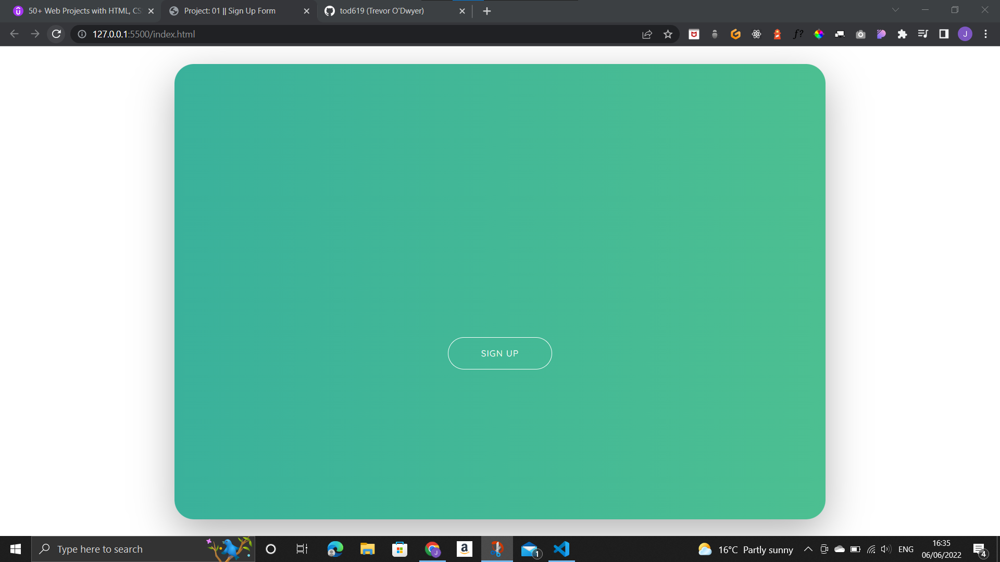
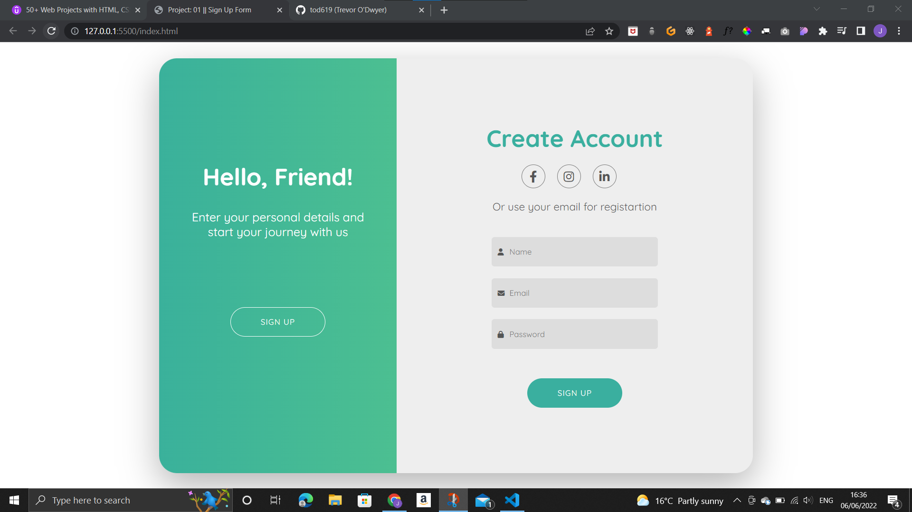

# 01_SignUp

## Description

These projects are all part of 50 different smaller practice projects that I plan to complete over the comming weeks to proactice HTML, CSS, and JavaScript. They will be small in scope but will help me refresh differen aspects of front end developement. This is the first project a signup form.
A sign up form that uses an animation to display the form to the user. When the user first comes onto the screen a green overlay is displayed to the user with a signup button which can be seen in the first image.

The second image shows the revealed form after the user clicks the signup button.

When the user clicks the signup button on the left again the page returns to its original position.

## Demo

A demo of the project can be found here: https://tod619.github.io/01_SignUp/ Bear in mind that this project is not fully responsive and was only created with the goal of refreshing my knowledge of JS.
